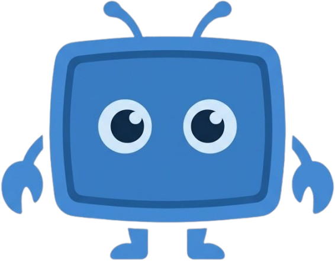

<p align="center">
  
</p>

> [!WARNING]
> This project is under active development and is not ready for production use.

# Screen Claw

NodeJS Screen Automation Agent(s) using custom SKILLS and optimized for local Computer Vision with OpenAI API compatibility (Ollama, LM Studio, LocalAI, vLLM, etc.).

**No cloud subscription needed. Turn your gaming PC into a automated productivity tool for "free".**

Tested with:
* `Qwen3.5-9B` (8gb VRAM)
  - A good balance between performance and quality
* `Qwen3.5-35B-A3B` (24gb VRAM)
  - Powerfull and very fast

## Quick start

```bash
npx screen-claw
```

## Requirements

- **OS**: Linux (X11 and Wayland supported)
- **Node.js**: v20+ (requires `build-essential` for native addon compilation: `sudo apt install -y build-essential`)
- **OpenAI-compatible API**: Ollama, LM Studio, LocalAI, vLLM, etc.

### Hardware
- **Tested Screen resolution**: 1280x720 (recommended), 1920x1080 (slower but works)
- **Tested GPU**: RTX 4060 8GB/16GB, RTX 3090 24GB

## Admin Panel

Once running, open **http://localhost:3010** to access the admin panel to manage missions, skills and logs. You can also do it yourself from the file system.

## Missions

Missions are task instructions that Screen Claw will perform periodically. They are defined in the `missions/<mission-name>/MISSION.md` file. Use natural language for scheduling and mission instructions.

`missions/linkedin-to-gmail/MISSION.md`

```
4 times a day, check the 10 firsts posts from my feed, and send me a summary of the most relevant ones to my.email@gmail.com using gmail.
```

## Skills

Screen Claw will automatically load relevant **App Skills** for the visible application using `skills/app/SKILL.md` instructions and the `description` frontmatter field of each skill in `skills/app`.

### App Skills

Browser example: `skills/app/browser/SKILL.md`

```
---
description: "A web browser window (Chrome, Brave, Firefox, etc.) displaying websites. Features an address bar at the top and navigation buttons."
sub-skills: "website"
---

Use keyboard alt+left to go back, never use the back button.
```

### Sub Skills

If an app skill has a `sub-skills` field, Screen Claw will automatically load the corresponding sub skills using `skills/<category>/SKILL.md` instructions and the `description` frontmatter field of each skill in `skills/<category>`.

Website example: `skills/website/gmail/SKILL.md`

```
---
description: "Gmail: Left sidebar with 'Compose' button and folders. Central list of emails with checkboxes and stars. Top 'Search mail' bar"
---

## Creating an email

1. Click on the compose button in the top left corner, a small windows on the bottom right will appear.
2. The "To" field is automatically focused, so directly write the target email address.
3. Press tab to move to the "Subject" field and write the subject of the email.
4. Press tab to move to the "Body" field and write the body of the email.
5. Click on the send button in the bottom right corner.
```

## Environment variables

| Variable | Default | Description |
|---|---|---|
| `ADMIN_PORT` | `3010` | Port for the admin panel |
| `LLM_SERVER_URL` | `http://localhost:4000` | Base URL of your LLM server (`/v1` is appended automatically) |
| `MODEL_ID` | — | Model name to use (e.g. `qwen3.5-9b`) |
| `SCHEDULER_CRON` | `* * * * *` | Cron expression for the scheduler frequency |

## Development

### Install and run

```bash
# Clone and install
git clone https://github.com/your-org/screen-claw
cd screen-claw
npm install
cd src/admin && npm install && cd ../..

# Copy and fill in your environment
cp .env.example .env

# Start the server
npm run dev

# Or run a single agent from CLI
npm run agent [runner|computer|scheduler] "your prompt"

# Production build
npm run build
```

## License

MIT
